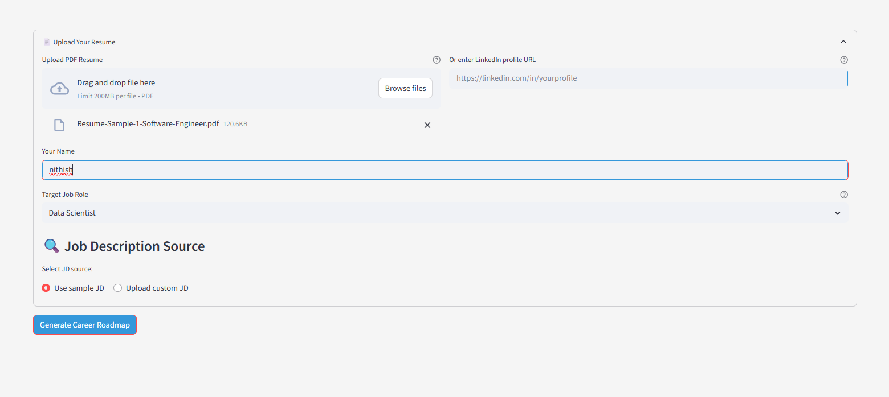

# 📘 AI-Powered Career Roadmap Planner

A **Streamlit-based agentic AI application** that guides users through a personalized learning roadmap by analyzing their resumes and mapping them to desired job roles using **LangChain agents**, **RAG (Retrieval Augmented Generation)**, and **Gemini 1.5 Flash**.

---

## 🚀 Features

- ✅ Resume parsing and skill extraction
- 🎯 Job role requirement analysis with RAG
- 🧠 Skill gap analysis using LLM agents
- 📆 12-week personalized learning roadmap with milestones
- 📊 Skill visualization with Plotly
- 🌈 Responsive and colorful UI with theme support

---

## 🔧 Tech Stack

| Layer            | Tools Used                                                    |
| ---------------- | ------------------------------------------------------------- |
| **Frontend**     | Streamlit, HTML/CSS (custom styles), Plotly for visualization |
| **Backend**      | Python, LangChain, LangChain Agents                           |
| **LLM**          | Gemini 1.5 Flash via `langchain_google_genai`                 |
| **Embedding**    | Google Generative AI Embeddings                               |
| **Vector Store** | FAISS (in-memory)                                             |
| **File Parsing** | `PyPDFLoader` for resume PDF parsing                          |

---

## 🧭 Workflow

# 📊 Learning Path Correction System Flow

graph TD
    A[Frontend: React App] -->|HTTP Requests| B[Backend: Flask API]
    B --> C[Misconception Detector]
    B --> D[Classification Agent]
    B --> E[Intervention Generator]
    B --> F[Roadmap Adjuster]
    B --> G[Progress Tracker]
    C --> H[Gemini LLM]
    D --> H
    E --> H
    F --> H
    D --> I[FAISS Vector Store]
    B --> J[(MongoDB)]

## 🧠 LangChain Agent Architecture

This app uses `AgentExecutor` to compose multiple tools, which are themselves LangChain functions. These tools:

1. **`analyze_resume`**: Extract skills, experience from parsed resume text.
2. **`get_role_requirements`**: Use RAG to retrieve job role requirements from vector DB.
3. **`analyze_gaps`**: Compare user profile vs job requirements.
4. **`build_roadmap`**: Generate a learning roadmap using skill gaps.

Each tool is invoked as part of an **LLM-powered agent** with prompt templates and `StrOutputParser` to structure JSON outputs.

---

## 🖥️ Code Structure & Flow

1. **UI Setup**: `setup_ui()`, `show_header()`
2. **Resume Upload & Input**: `resume_input_section()`
3. **Main Agent Logic**:

   - Class `CareerRoadmapPlanner`

     - Loads Gemini models + FAISS
     - Initializes LangChain tools
     - Composes agent with `AgentExecutor`

4. **Result Display**: `display_results()` shows skill bars, tables, milestones, download option

---

## 📁 .streamlit/secrets.toml

Make sure your `.streamlit/secrets.toml` has the following:

```toml
GEMINI_API_KEY="your_google_gemini_api_key"
```

---

## ▶️ Run the App

```bash
pip install -r requirements.txt
streamlit run main.py
```

---

## 📌 Future Enhancements

- 🔗 LinkedIn profile integration
- ☁️ Cloud deployment with persistent vectorstore
- 📥 Export roadmap as PDF or email
- 👥 Multi-user session management

---

## 📸 Screenshots

> Include here: Resume Upload, Skill Gap Chart, Roadmap Week View

## 📸 Screenshots

### 📄 Resume Upload & Role Selection



### 📊 Skill Gap Analysis


### 🗺️ Learning Roadmap Preview

## 

## 📃 License

MIT License

---

## 🤖 Built with ❤️ using LangChain + Gemini + Streamlit
